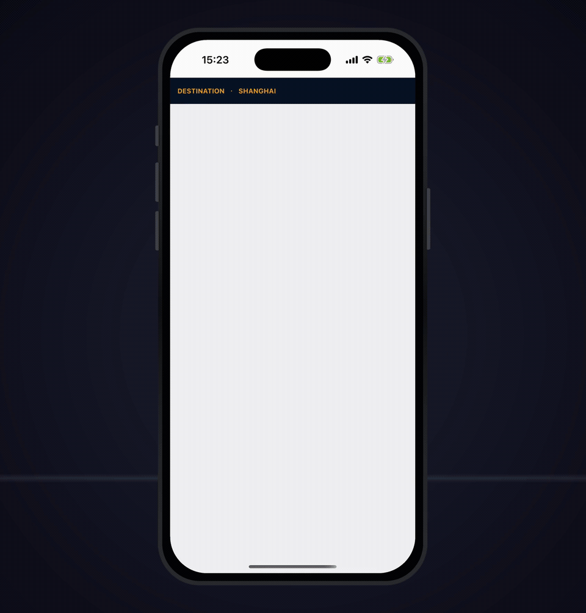
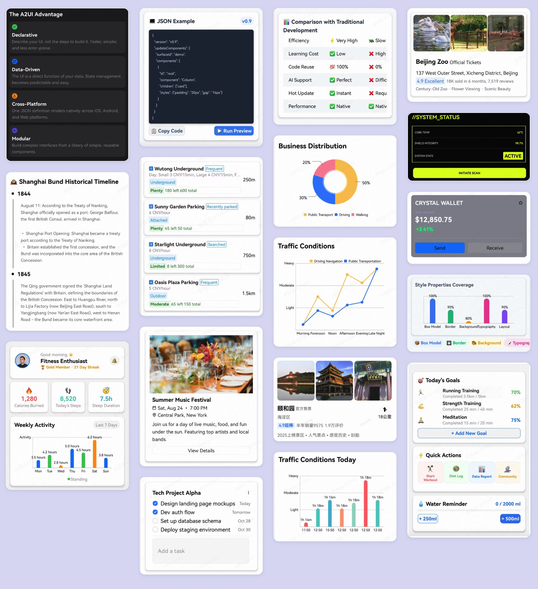
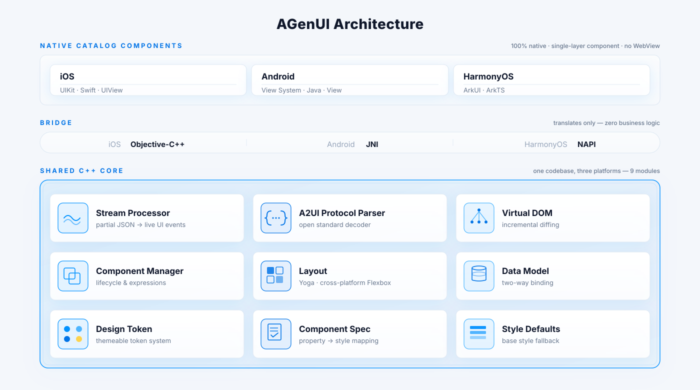
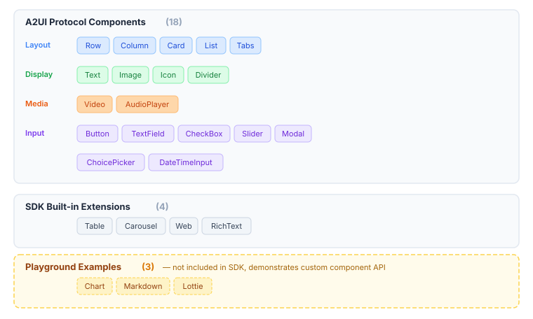

<div align="center">

# AGenUI

**AGenUI is a high-performance A2UI SDK for building native generative UI experiences across iOS, Android, and HarmonyOS.**



[](LICENSE)
[](#)
[](#)
[](#)
[](#)

[**Official Website**](https://genui.amap.com) · [**Quick Start**](docs/QuickStart.md) · [**API Reference**](docs/API.md) · [**Contributing**](CONTRIBUTING.md)

English | [中文](README.zh-CN.md)

</div>

> This project is under active development and evolving rapidly. Contributions, feedback, and discussions are warmly welcome.

---

## What's New in v1.4.0

> Released on 2026-08-21

- **Shadow & Border-Radius Rendering Rework**: Border radius now applies clipping by default; the shadow layer is rendered independently of component content so it is no longer clipped by the component. The `addChild` logic no longer relies on index computation. .
- **Style Default Alignment**: Unified default style values across Android, iOS, and HarmonyOS (including font styles and default text size); aligned Android text measurement and style parsing with the other platforms. Styles parsing was refactored to be more cohesive in preparation for this alignment.
- **Unified `null` Handling in Incremental Updates**: Component data no longer retains `null` values on Android and HarmonyOS, and first-level property `null` behavior is aligned across all built-in components. On iOS, properties with `NSNull` values are now treated as property removal instead of being silently dropped; a `removeProperties` API was added to the render layer, and styles are no longer flattened into first-level properties.
- **Deep Data Binding for Custom Components**: Custom components now support deep resolution of data bindings within nested properties.
- (Core) Fixed a low-probability stability issue by returning the surface manager from `findSurfaceManager` as a `shared_ptr` (HarmonyOS usage updated accordingly).
- (iOS) Fixed the `display` style incorrectly overriding the `visibility` style. Fixed shadow rendering linkage issues.
- (Android) Fixed string-valued `font-weight` falling back to the binary Typeface path. Fixed AudioPlayer and ChoicePicker component issues. Removed unnecessary click and focus configuration on components.
- (HarmonyOS) Fixed the right border disappearing on certain device models. Fixed an ArkTS compilation error in `Component.triggerAction`.
- (All) Fixed the default text size across the three platforms.

---

## What is AGenUI?

**AGenUI** is an A2UI SDK that simultaneously supports iOS, Android, and HarmonyOS. Built on and fully implementing the [A2UI v0.9 protocol open-sourced by Google](https://github.com/google/A2UI), it renders the streaming data of LLM-generated interactive UI in real time on mobile devices. Under the hood, it is powered by a cross-platform **shared C++ core engine**, while the three-platform rendering engines consume the component protocol dispatched by the core engine and perform drawing using native system capabilities.

**AGenUI** leverages native system UI capabilities to render **interactive cards, forms, lists, images, media players, and more**, delivering a high-performance, smooth user experience.



---

## Key Features

- **Real-time streaming rendering** — structured component descriptions are generated by the LLM, arrive incrementally, and update in real time
- **High performance** — native rendering on iOS, Android, and HarmonyOS, maintaining a 120 fps refresh rate in core scenarios such as page scrolling
- **22 built-in components** — 18 A2UI protocol components + 4 SDK extension components
- **Custom component API** — register and extend native components via the custom component API, so the LLM can emit component descriptions by component name
- **Function Call integration** — register client-side tools/functions that the LLM can invoke on demand
- **Design Token & theming** — unified Design Token system and theme modes across all three platforms
- **Light / Dark mode** — built-in light/dark appearance switching

---

## Architecture

AGenUI adopts a **shared C++ core engine + three-platform component rendering engines** design.
The C++ layer implements capabilities shared across all three platforms, including streaming data parsing, virtual component tree management, render data caching, theme/style resolution, and component change diffing. The C++ layer synchronizes the parsed component protocol to the three-platform rendering engines to trigger drawing.

<div align="center">

</div>

### Project Directory

| Path | Contents |
|---|---|
| `core/` | C++ core engine — parser, differ, layout, Function Call framework |
| `core/include/` | Public C++ API consumed by platform bridging layers |
| `platforms/ios/` | iOS component renderer + Objective-C bridge |
| `platforms/android/` | Android component renderer + JNI bridge |
| `platforms/harmony/` | HarmonyOS component renderer + NAPI bridge |
| `playground/` | Three-platform demo apps for development & debugging |
| `scripts/` | Build scripts for each platform |

---

## Components

<div align="center">

</div>

### A2UI Protocol Components

The following 18 components implement the A2UI protocol specification and are supported on all three platforms.

| Component | Description |
|---|---|
| `Text` | Styled text with variants (h1–h5, body, caption, etc.) |
| `Image` | Network image with scale modes and rounded corners |
| `Icon` | Icon rendered via Unicode / SVG mapping |
| `Divider` | Horizontal or vertical separator |
| `Video` | Native video player with seek and auto-hiding controls |
| `AudioPlayer` | Audio player with progress bar |
| `Button` | Tappable button that triggers Action events |
| `Row` | Horizontal flex container |
| `Column` | Vertical flex container |
| `Card` | Shadowed card container |
| `List` | Scrollable list with static or template-driven children |
| `Tabs` | Tab bar with switchable panels |
| `Modal` | Native dialog overlay |
| `TextField` | Text input with optional validation |
| `CheckBox` | Boolean toggle |
| `Slider` | Numeric range input |
| `ChoicePicker` | Single / multi-select picker |
| `DateTimeInput` | Date and time picker |

### SDK Built-in Extension Components

The following 4 components are bundled with the SDK but are not part of the A2UI protocol specification.

| Component | Description |
|---|---|
| `Table` | Data table with Yoga sub-layout |
| `Carousel` | Image / content carousel |
| `Web` | Embedded WebView |
| `RichText` | HTML rich text rendering |

### Playground Example Components

The following 3 components are registered and applied in the Playground to demonstrate integrating custom components via the API.

| Component | Description |
|---|---|
| `Chart` | Bar, line, and pie charts |
| `Markdown` | Markdown rendering with streaming support |
| `Lottie` | Lottie animation playback |

You can register your own components at runtime using the same API — see the [Quick Start](#quick-start) section.

---

## Catalog File

The repository root includes `agenui_catalog.json`, a **self-contained ([freestanding](https://github.com/google/A2UI/blob/main/docs/concepts/catalogs.md#freestanding-catalogs)) Catalog JSON Schema file** conforming to the [A2UI v0.9 specification](https://github.com/google/A2UI/blob/main/docs/concepts/catalogs.md). All external `$ref`s have been inlined — it can be used standalone with no external dependencies.

**Coverage:**

- **25 components**: 18 A2UI protocol standard components + 4 SDK built-in extension components (`Table`, `Carousel`, `Web`, `RichText`), plus 3 Playground example components (`Chart`, `Markdown`, `Lottie`)
- **14 functions**: covering validation, formatting, logical operators, and URL navigation
- **Shared type definitions**: includes all A2UI v0.9 standard types, as well as `Styles` (general style properties) and `TextStyles` (text-specific style properties) — both extended by AGenUI

**How to use:**

When integrating an LLM Agent, supply this file's content or its hosted URL as the `catalogId` in the `supportedCatalogIds` field of [A2UI ClientCapabilities](https://github.com/google/A2UI/blob/main/docs/concepts/catalogs.md#a2ui-catalog-negotiation). The Agent will use this Schema as a constraint to generate strictly conformant A2UI JSON messages, ensuring the renderer correctly parses and renders all dispatched UI components.

---

## A2UI Generation Skill

The `skills/a2ui-generation/` directory ships a standalone **A2UI generation Skill** that can be mounted into any Agent that supports the [Agent Skills](https://www.anthropic.com/engineering/equipping-agents-for-the-real-world-with-agent-skills) mechanism (e.g. Claude Code, Cursor, Codex, Gemini CLI, Windsurf, GitHub Copilot, etc.). It guides the LLM — via the Skill's built-in design rules and constraints — to turn a natural-language query into A2UI protocol messages (`updateComponents` / `updateDataModel`) that AGenUI can render directly.

### Installation

**One-command install (recommended)**

```bash
npx skills add AGenUI/AGenUI
```

Supports 55+ AI coding agent runtimes, including Claude Code, Cursor, Codex, Gemini CLI, Windsurf, GitHub Copilot, and more.

**Manual install**

```bash
git clone https://github.com/AGenUI/AGenUI.git
cp -r AGenUI/skills/a2ui-generation ~/.claude/skills/
```

> For other runtimes, copy the `skills/a2ui-generation/` directory to the corresponding skills directory (e.g. `~/.cursor/skills/`, `~/.codex/skills/`).

### How to use

After installation, describe the UI you want through a query in your agent. The Skill drives the LLM to emit A2UI v0.9–conformant JSON protocol.

### Layout & styling

- **Default shape**: a single **Card**, focused on the essential information.
- **Custom layout & styling**: your query can explicitly request other shapes (full page, list, table, etc.) or specific visual requirements (palette, spacing, font sizes, theme). When your explicit instruction conflicts with the Skill's defaults, the explicit instruction wins.

### LLM selection

Different LLMs may produce somewhat different results when generating A2UI output. We recommend trying a few models against your own scenarios and picking the one that fits best.

## AGenUI Studio

AGenUI Studio is a local, **bring-your-own-key** workbench that turns natural-language descriptions into renderable A2UI protocol — with a browser UI for streaming generation, live protocol preview, validation, and one-tap push to the AGenUI Playground on a real device via QR code. It builds on the open-source [A2UI generation Skill](skills/a2ui-generation) (reusing its design rules and validator) and supports multiple LLM providers (DeepSeek, Qwen, GLM, OpenAI, Gemini, and more) and runs entirely on your machine.

```bash
npx agenui-studio
```

👉 See [playground/studio/README.md](playground/studio/README.md) for installation, configuration, and architecture details.

---

## Quick Start

### Toolchain Requirements

| Platform | Toolchain |
|---|---|
| Android | Android Studio Hedgehog+, NDK 27.3.13750724, API 35 SDK, JDK 11 |
| iOS | Xcode 15+, CocoaPods, CMake |
| HarmonyOS | DevEco Studio 4.0+, ohpm |

### Building from Source

All build scripts live in the `scripts/` directory. The C++ engine in `core/` is compiled automatically — no separate preparation step is needed.

**Android**

```bash
# Release AAR (default)
./scripts/android/build.sh

# Debug AAR
./scripts/android/build.sh --debug

# Release AAR + native debug-symbol companion (see "Native debug symbols" below)
./scripts/android/build.sh --with-symbols

# Publish to local Maven (~/.m2)
./scripts/android/build.sh --publish-local

# Publish debug AAR to local Maven
./scripts/android/build.sh --debug --publish-local

# Publish to remote Maven (requires MAVEN_URL / MAVEN_USERNAME / MAVEN_PASSWORD env vars)
./scripts/android/build.sh --publish-maven

# Clean before building
./scripts/android/build.sh --clean
```

The AAR is written to `dist/android/release/`.

**Native debug symbols (Android, opt-in)**

For symbolicating release crashes on the host, run `./scripts/android/build.sh --with-symbols`. The release build then:

1. Skips `-Wl,--strip-all` so the linker output retains DWARF info.
2. Splits DWARF into a sibling `lib<name>.so.debug` via `objcopy --only-keep-debug` (CMake POST_BUILD), then strips the `.so` and links them via `.gnu_debuglink`.
3. Packages the `.so.debug` files into `<rootProject.name>-symbols.aar` alongside the regular release AAR, under `build/outputs/aar/`.

The release AAR size is unaffected — AGP strips the `.so` before packaging anyway. The `.so.debug` suffix follows the GNU/LLVM convention (objcopy's default debug extension) and has no relation to Android's `debug` buildType.

To symbolicate a crash address, unzip the symbols AAR and feed `.so.debug` to standard tools:

```bash
unzip -j <name>-symbols.aar 'jni/arm64-v8a/*.so.debug' -d ./symbols/

# Single address
$ANDROID_NDK/toolchains/llvm/prebuilt/<host>/bin/llvm-addr2line \
    -e ./symbols/lib<name>.so.debug -f -C 0xADDR

# Full backtrace from logcat
$ANDROID_NDK/toolchains/llvm/prebuilt/<host>/bin/ndk-stack \
    -sym ./symbols/ -dump crash.log
```

The flag is OFF by default — open-source builds see no change unless explicitly enabled.

**iOS**

```bash
# XCFramework (Release, default)
./scripts/ios/build.sh

# Single-arch Framework, Debug
./scripts/ios/build.sh -t framework -c Debug

# Force pod install then build
./scripts/ios/build.sh --pod-install
```

**HarmonyOS**

```bash
# HAR package (Release, default)
./scripts/harmony/build.sh

# Debug build
./scripts/harmony/build.sh --mode debug

# Custom output directory
./scripts/harmony/build.sh -o /path/to/output
```

### Debugging with the Playground

A standalone Playground project is provided for each platform under `playground`. You can open and run any Playground project to experience the full A2UI component rendering. Each Playground references the AGenUI source code directly, so breakpoint debugging is supported.

**Android Playground**

- Open `playground/android/` with Android Studio
- Let Gradle install dependencies and index the source files
- Switch dependency mode via `gradle.properties`:

```
# Source mode: changes to the C++ engine and the Android renderer take effect immediately
agenui.sdk.source=true

# AAR mode: no longer references source; consumes the pre-packaged SDK build (recommended only when debugging the Playground itself)
agenui.sdk.source=false
```

**iOS Playground**

- Enter the `playground/ios/Playground` directory
- Run `pod install` to install dependencies and generate the Xcode workspace; on success, `Playground.xcworkspace` will be generated under `playground/ios/Playground`
- Open `Playground.xcworkspace`, pick a simulator, and build & run

*`Playground.xcworkspace` already contains both the AGenUI source and the Playground target*

**HarmonyOS Playground**

- Open the `playground/harmony` directory with DevEco Studio
- Let it install dependencies and index the source files
- Pick a simulator, and build & run

*The project references `platforms/harmony/agenui/` via `srcPath`, so any change to the AGenUI source is automatically picked up by the next build*

### Integrating the AGenUI SDK

For details on building the source into a directly integrable artifact (see [Building from Source](#building-from-source)) and integrating it into your application, please refer to:

> SDK installation & usage guide: [Quick Start](docs/QuickStart.md)
>
> Complete SDK API reference: [API Reference](docs/API.md)

---

## Contributing

Contributions of all kinds are welcome — bug fixes, new components, platform improvements, documentation, and test coverage.

Before submitting a pull request, please read [CONTRIBUTING.md](CONTRIBUTING.md) for the full workflow, code style guidelines (C++, Swift, and Java follow the Google Style Guide; ArkTS follows the OpenHarmony conventions), and the PR checklist.

**Quick summary:**

1. Fork the repo and create a branch from `main`: `fix/123-my-fix` or `feat/my-feature`
2. Make your changes and add tests where appropriate
3. Build and test locally on the affected platform(s)
4. Open a PR against `main` with a clear description of *what* and *why*
5. At least one maintainer approval is required before merging

For larger changes — new platform support, significant engine refactors, new component categories — please open an issue first to align on the approach before writing code.

---

## Community & Contact

- **GitHub Issues**: [bug reports and feature requests](https://github.com/AGenUI/AGenUI/issues)
- **GitHub Discussions**: [Q&A and general discussions](https://github.com/AGenUI/AGenUI/discussions)
- **Email**: [tengjixiang.ttjx@alibaba-inc.com](mailto:tengjixiang.ttjx@alibaba-inc.com)
- **DingTalk Group**: Chinese community
- **WeChat Group**: Chinese community

<div align="center">
<table>
  <tr>
    <th>DingTalk Group</th>
    <th>WeChat Group</th>
  </tr>
  <tr>
    <td align="center"></td>
    <td align="center"></td>
  </tr>
</table>
</div>

---

## License

AGenUI is released under the [Apache License, Version 2.0](LICENSE).
